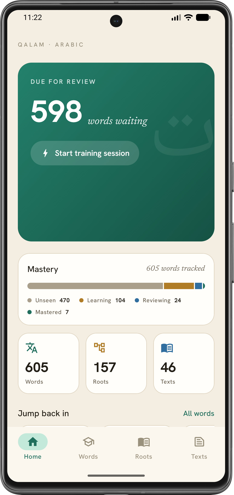
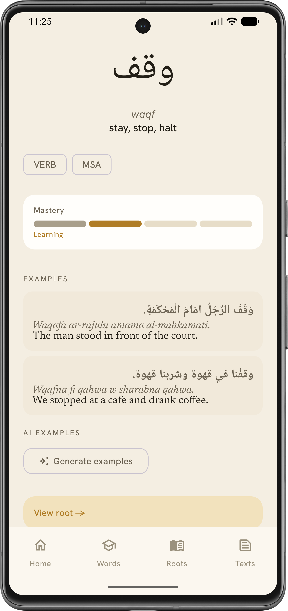
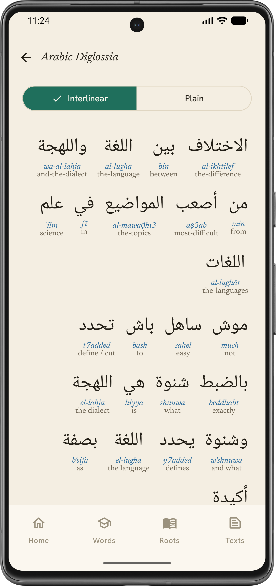
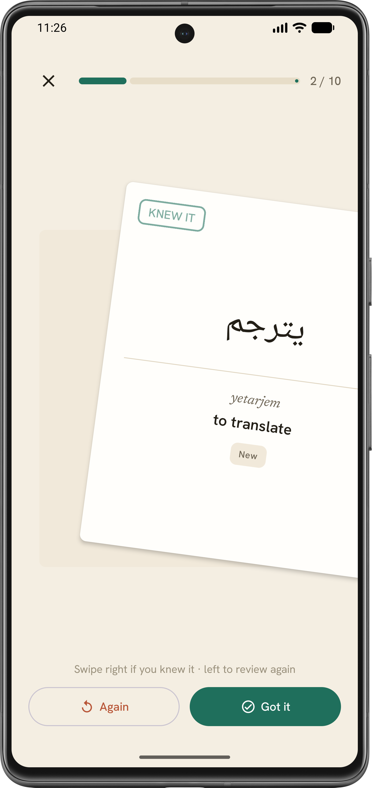

# Qalam Android

[](https://freepalestine.dev)
[](https://github.com/amasotti/qalam-app/actions/workflows/ci.yml)


Native Android companion to [Qalam](https://github.com/amasotti/qalam) — a personal Arabic
vocabulary and text-study tool. Single user, read-and-train focused. Talks to the Ktor backend
over Tailscale (no Play Store, sideloaded only).

## Screenshots

<div align="center">
<table>
  <tr>
    <td align="center"><br/><sub>Home</sub></td>
    <td align="center"><br/><sub>Word detail</sub></td>
  </tr>
  <tr>
    <td align="center"><br/><sub>Interlinear reader</sub></td>
    <td align="center"><br/><sub>Training / SRS</sub></td>
  </tr>
</table>
</div>

## What it does

| Screen | Purpose |
|--------|---------|
| Home | Greeting, connection pill, due-for-review hero, mastery overview, quick stats, recent words |
| Words | Dictionary with search, mastery filter, pagination, quick-add via bottom sheet |
| Word detail | Arabic hero, mastery bar, examples, AI examples, AI insight, dictionary + root links, sibling words |
| Roots | Trilateral-root browser; root detail with semantic note and derivation family |
| Texts | Interlinear reader with per-token gloss bottom sheet; interlinear/plain toggle |
| Training | SRS flashcard loop (swipe right = got it, left = again) + session summary |
| Settings | Backend URL + connection test |

AI examples and AI insight (word/root explanations) are generated on demand by the backend; the app
degrades gracefully when the AI service is unavailable.

## Tech stack

| | |
|---|---|
| Language | Kotlin 2.4.0 (JVM 17) |
| UI | Jetpack Compose + Material 3 |
| Navigation | Navigation3 (`androidx.navigation3`) — typed `Destination` sealed interface, `SnapshotStateList` back stack |
| HTTP | Ktor Client 3.x (Android engine) + kotlinx.serialization |
| Async / state | Coroutines + `StateFlow` per-screen sealed `UiState` |
| Preferences | DataStore |
| DI | Hilt (KSP) |
| Build | Gradle Kotlin DSL + version catalog (`gradle/libs.versions.toml`) |
| SDK | min 31, target/compile 37 |
| Static analysis | detekt (`config/detekt/detekt.yml`) |

## Prerequisites

- Android Studio, JDK 17+, Android SDK (min API 31)
- [ADB](https://developer.android.com/tools/adb) on `PATH`
- Phone with Developer Options → USB (or Wireless) Debugging enabled
- [Tailscale](https://tailscale.com) on both phone and backend host — the app reaches the backend at
  its Tailscale address (raw IP or `<host>.ts.net`)

## Build & install

Uses [`just`](https://github.com/casey/just) as the task runner — run `just` for the full recipe list.

```bash
just build            # assembleDebug
just install          # build + adb install on connected device
just run              # build + install + launch

# Wireless ADB (pair once via Developer Options → Wireless Debugging)
just pair IP PORT     # pairing IP:port
just connect IP PORT  # main wireless IP:port
just install
```

## First launch

Open **Settings**, set the backend URL to your backend's Tailscale address (default is a raw
Tailscale IP; change it to your own), tap **Test connection** (`GET /health`). The connection pill on
Home turns green (pulsing) when the backend is reachable, terra/steady when not.

## Quality

```bash
just detekt   # static analysis — mandatory before finishing a change
just test     # unit tests
just lint     # Android lint
just check    # lint + detekt + test
```

## Docs

- [`docs/architecture.md`](docs/architecture.md) — layer rules, API contract, key decisions
- [`docs/design-system.md`](docs/design-system.md) — color/typography tokens, components, animations
- [`docs/runbooks/release-sideloading.md`](docs/runbooks/release-sideloading.md) — signed release build & sideload
